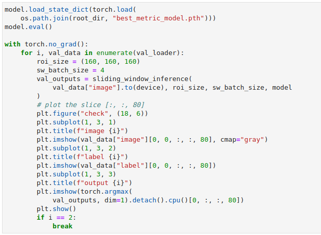
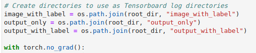
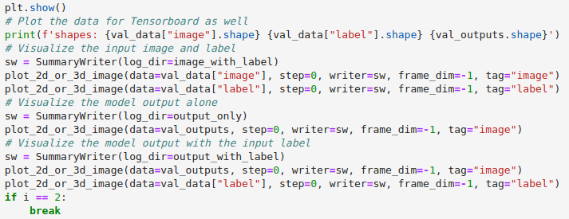
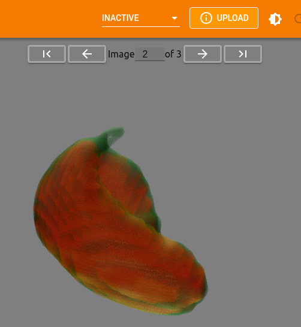
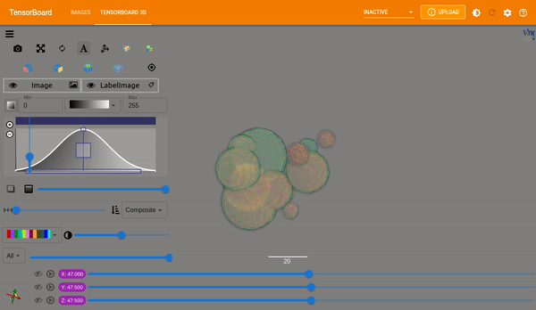

==============================
JupyterLab and Colab Notebooks
==============================

Installation
------------
To install the TensorBoardPlugin3D python package inside the notebook:

    .. code-block::

        !pip install tensorboard_plugin_3d

Usage
-----

This documentation uses the ``spleen_segmentation_3d`` tutorial notebook
provided by MONAI as the starting point and demonstrates how to expand on the
notebook to take advantage of the 3D plugin with only a few additional lines.
See the bottom of this page for links to available example notebooks.

Plot Images
###########

MONAI provides ``plot_2d_or_3d_image`` and the related ignite handler to plot
the 3D image in TensorBoard. Originally the output model and input image and
label could only be visualized with matplotlib. This limited the view to a
single slice though.

For the purposes of this tutorial we will write out multiple views to get an
idea of the different ways we can visualize data. Outside of the loop (above
the ``torch.no_grad()`` call) we will create directories for each combination
of input and output we would like to view. TensorBoard takes in a directory as
the ``logdir`` to read from, so creating separate directories simplifies
selecting which data to display.

Within the loop we can then add the calls to ``plot_2d_or_3d_image`` to create
the event files that TensorBoard will need.

The call to ``plot_2d_or_3d_image`` takes several parameters:

    - *data*
        Target data to be plotted as image on the TensorBoard. The data is
        expected to have ``NCHW[D]`` dimensions and only plot the first in the
        batch. This shape is important and required to write out the full 3D
        image.
    - *step*
        Current step to plot in a chart.
    - *writer*
        Specify a SummaryWriter to plot the image. You should create a new
        SummaryWriter object for each new image or image/label pair that you
        create so that they are grouped together.
    - *frame_dim*
        Specify the dimension used as frames, expects input data shape as
        ``NCHWD``. Defaults to -3 (the first spatial dim). For our use case we
        will pass in ``-1`` to use the depth dimension.
    - *tag*
        Tag of the plotted image on TensorBoard. This is used by the plugin to
        determine which is an image and which is a label.

Of the parameters passed to ``plot_2d_or_3d_image`` there are three especially
important pieces to plotting the images so that they work with the plugin:

    1. The ``SummaryWriter``. A new SummaryWriter should be created for each
       image or image/label pair, even if all of the data will be written to
       the same directory. This creates a new event file for each image or pair
       of images which is what the plugin uses to determine which data to
       associate with what.
    2. The ``data``. As explained above, the data that is passed in is expected
       to have ``NCHW[D]`` dimensions. If the data does not match this shape,
       PyTorch provides an ``unsqueeze`` method that can be used to insert a
       dimension of size 1 inserted at the specified position.
    3. The ``tag``. This must be set to either ``image`` or ``label`` to
       indicate the role of the data. Without this images may not be shown with
       their label or may not be displayed at all.

Select Images to View
#####################

To select which images to view simply pass the directory to the TensorBoard
``logdir`` flag.

.. code-block::

    %load_ext tensorboard
    %tensorboard --logdir=$output_with_label

The plugin will display the most recent image data first. Each of the three
directories created should contain three images or image/label combinations, so
pointing to any one of them will provide three images that can be viewed. If,
however, the ``logdir`` were set to be ``root_dir`` instead, only the most 
recent from each of the child directories would be available to view.

Switching Images
################

If multiple images are available within the selected ``logdir`` there will be
an option to toggle between them or jump to a specific image.

Any and all settings that are applied to an image are carried over to the next
image as well. This allows you to get the vis settings just right before
flipping through available images and comparing results.

Example Notebooks
-----------------
**UNet Segmentation 3D Ignite**

Quick example notebook demonstrating 3D segmentation with UNet. This notebook
uses simple demo data and is a great starting place if you want to see the
whole training process and output together without much wait.

    .. image:: https://colab.research.google.com/assets/colab-badge.svg
        :target: https://colab.research.google.com/github/KitwareMedical/tensorboard-plugin-3d/blob/main/demo/notebook/unet_segmentation_3d_ignite.ipynb
        :alt: Open in Colab

**Spleen Segmentation 3D**

*spleen_segmentation_3d*: Demonstrates 3D segmentation of a spleen dataset.
Training in this notebook takes a bit longer than the UNet example but is a
great example of segmentation and medical imaging. Run this notebook the whole
way through to get a feel for the flow between the training process and viewing
and analyzing the output model in TensorBoard.

    .. image:: https://colab.research.google.com/assets/colab-badge.svg
        :target: https://colab.research.google.com/github/KitwareMedical/tensorboard-plugin-3d/blob/main/demo/notebook/spleen_segmentation_3d.ipynb
        :alt: Open in Colab

*cached_spleen_segmentation_3d*: This notebooks provides the cached data from
the Spleen Segmentation notebook in order to allow you to quickly load and view
the output models in TensorBoard. This is a great starting point if you would
like to quickly begin viewing and analyzing actual medical data.

    .. image:: https://colab.research.google.com/assets/colab-badge.svg
        :target: https://colab.research.google.com/github/KitwareMedical/tensorboard-plugin-3d/blob/main/demo/notebook/cached_spleen_segmentation_3d.ipynb
        :alt: Open in Colab

**Brats Segmentation 3D**

*brats_segmentation_3d*: Demonstrates 3D segmentation of a brain tumor dataset.
Like the Spleen Segementation, training in this notebook takes a bit longer to
run but is another great example of segmentation and medical imaging. Run this
notebook the whole way through to get a feel for the flow between the training
process and viewing and analyzing the output model in TensorBoard.

    .. image:: https://colab.research.google.com/assets/colab-badge.svg
        :target: https://colab.research.google.com/github/KitwareMedical/tensorboard-plugin-3d/blob/main/demo/notebook/brats_segmentation_3d.ipynb
        :alt: Open in Colab

*cached_brats_segmentation_3d*: This notebooks provides the cached data from
the Brats Segmentation notebook so that you are able to quickly load and view
the output models in TensorBoard. This is a great starting point if you would
like to quickly begin viewing and analyzing actual medical data.

    .. image:: https://colab.research.google.com/assets/colab-badge.svg
        :target: https://colab.research.google.com/github/KitwareMedical/tensorboard-plugin-3d/blob/main/demo/notebook/cached_brats_segmentation_3d.ipynb
        :alt: Open in Colab

