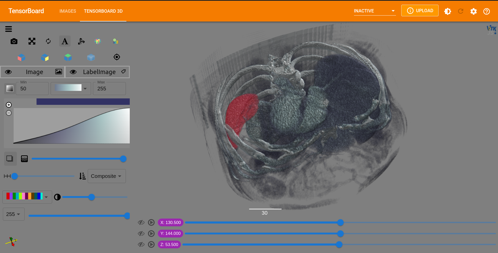

==============================
JupyterLab and Colab Notebooks
==============================

Installation
------------
To install the TensorboardPlugin3D python package inside the notebook:

    .. code-block::

        !pip install tensorboard_plugin_3d

Usage
-----
The plugin currently looks at the most recent image available in the log directory
and visualizes it. If two images are available for the most recent run and one
of them is tagged "label" it will be treated as such. Each image or image/label
pair can be written to its own log directory to make it simple to switch
between views. The directory to be used can then be set and visualized with the
tensorboard widget within either JupyterLab or Colab.

To break down some examples of options for writing out images we can look at
the UNet notebook:

.. image:: images/unet_notebook.png
   :alt: UNet Notebook Cells

In the first cell we are selecting the data that we would like to view, in this
case the first input image and label as well as the first output model. The
output model is then written out in the final line of the first cell shown:

    .. code-block::

        plot_2d_or_3d_image(data=val_outputs, step=0, writer=SummaryWriter(log_dir=log_dir), frame_dim=-1, tag="image")

The call to ``plot_2d_or_3d_image`` takes several parameters:

    - *data*
        Target data to be plotted as image on the TensorBoard. The data is
        expected to have ``NCHW[D]`` dimensions and only plot the first in the
        batch. This shape is important and required to write out the full 3D
        image.
    - *step*
        Current step to plot in a chart.
    - *writer*
        Specify a SummaryWriter to plot the image. You should create a new
        SummaryWriter object for each new image or image/label pair that you
        create so that they are grouped together.
    - *frame_dim*
        Specify the dimension used as frames, expects input data shape as
        ``NCHWD``. Defaults to -3 (the first spatial dim). For our use case we
        will pass in ``-1`` to use the depth dimension.
    - *tag*
        Tag of the plotted image on TensorBoard. This is used by the plugin to
        determine which is an image and which is a label.

Some options for writing out data include:
    1. Creating a new ``SummaryWriter`` object.

    Use a hierarchical folder structure to compare between runs easily. In the
    UNet example we are writing the output image to ``{root_dir}/logs``, so if
    we wanted to write out the output along with the input next we would point
    to a new directory.

        .. code-block::

            new_dir = os.path.join(root_dir, "output_and_input")
            sw = SummaryWriter(log_dir=new_dir)
            plot_2d_or_3d_image(data=val_outputs, step=0, writer=sw, frame_dim=-1, tag="image")
            plot_2d_or_3d_image(data=val_data[1], step=0, writer=sw, frame_dim=-1, tag="label")

    This allows us to simply pass in a new ``logdir`` for TensorBoard to view this data.

        .. code-block::

            %tensorboard --logdir=$new_dir

    2. Re-using an existing ``SummaryWriter``.

    When the ``SummaryWriter`` is re-used images are appended to an existing
    run (event file). The most recent addition(s) will be what is shown.
    This is a trickier option since only the most recent is shown and there
    is no simple way to going back to displaying the image(s) that were
    previously written. At this point it is recommended to take the
    approach outlined in item 1 above.

Important to note: The ``tag`` parameter is optional for ``plot_2d_or_3d_image``
but not for our purposes. All images without a ``label`` tag are assumed to be
separate images to be loaded individually.

Examples
--------
See the `spleen_segmentation`_ notebook for an example of viewing both the
input data and output model from real world data, or the `unet_segmentation`_
for a faster demonstration using sample data.

.. _spleen_segmentation: https://colab.research.google.com/github/KitwareMedical/tensorboard-plugin-3d/blob/main/demo/notebook/spleen_segmentation_3d.ipynb
.. _unet_segmentation: https://colab.research.google.com/github/KitwareMedical/tensorboard-plugin-3d/blob/main/demo/notebook/unet_segmentation_3d_ignite.ipynb

.. image:: images/unet.gif
   :alt: UNet Demo
