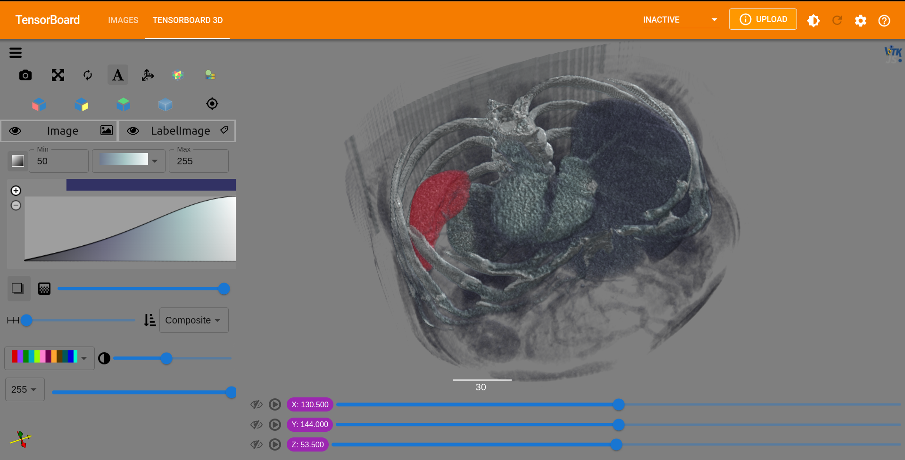

.. TensorBoardPlugin3D documentation master file, created by
   sphinx-quickstart on Tue Jan 11 16:45:33 2022.
   You can adapt this file completely to your liking, but it should at least
   contain the root `toctree` directive.

Welcome to TensorBoard Plugin 3D's documentation!
=================================================

TensorBoardPlugin3D is an open-source TensorBoard plugin that supports
visualizing 3D output within the TensorBoard application, JupyterLab, and
Google Colab. This plugin frontend is built using ITK/VTK Viewer components.

To install the stable python package:

   .. code-block:: bash

         $ pip install tensorboard_plugin_3d

.. image:: images/label_with_output.gif
   :alt: Output model with input

.. toctree::
   :maxdepth: 2
   :caption: Contents:

   Quick_start_guide.rst
   Jupyter_and_colab.rst
   Development.rst

Indices and tables
==================

* :ref:`genindex`
* :ref:`modindex`
* :ref:`search`

